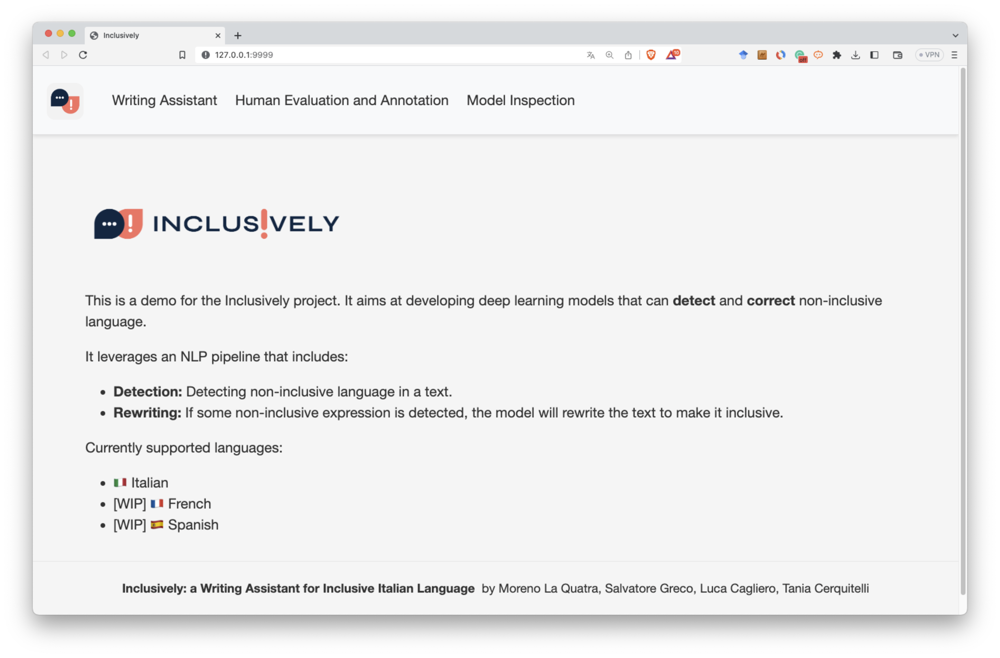
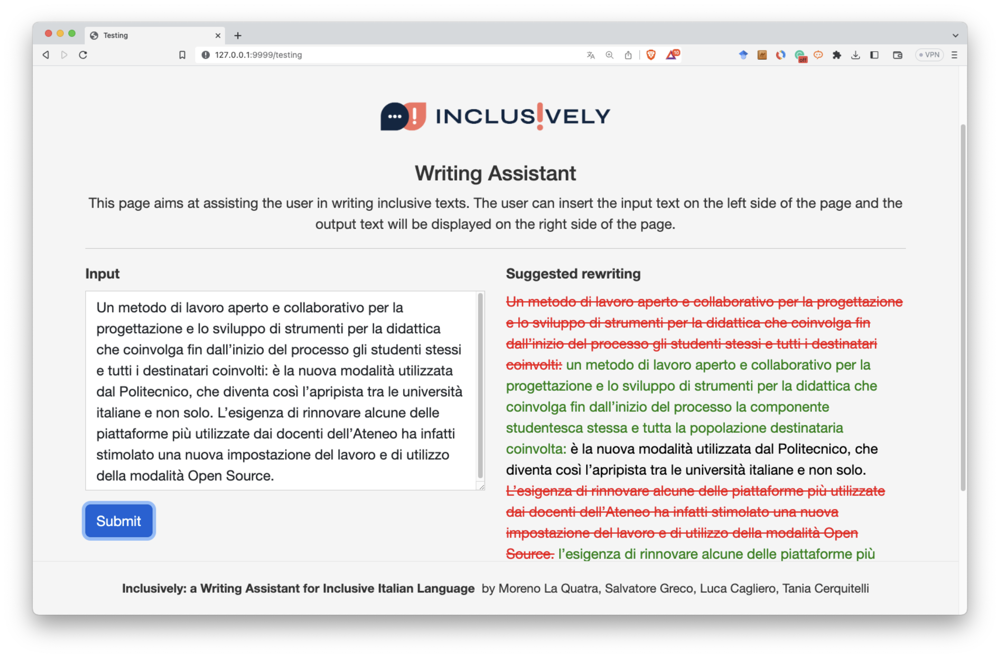
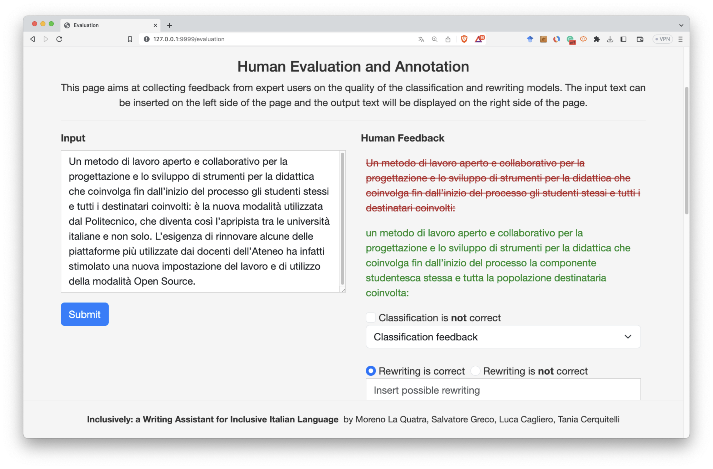
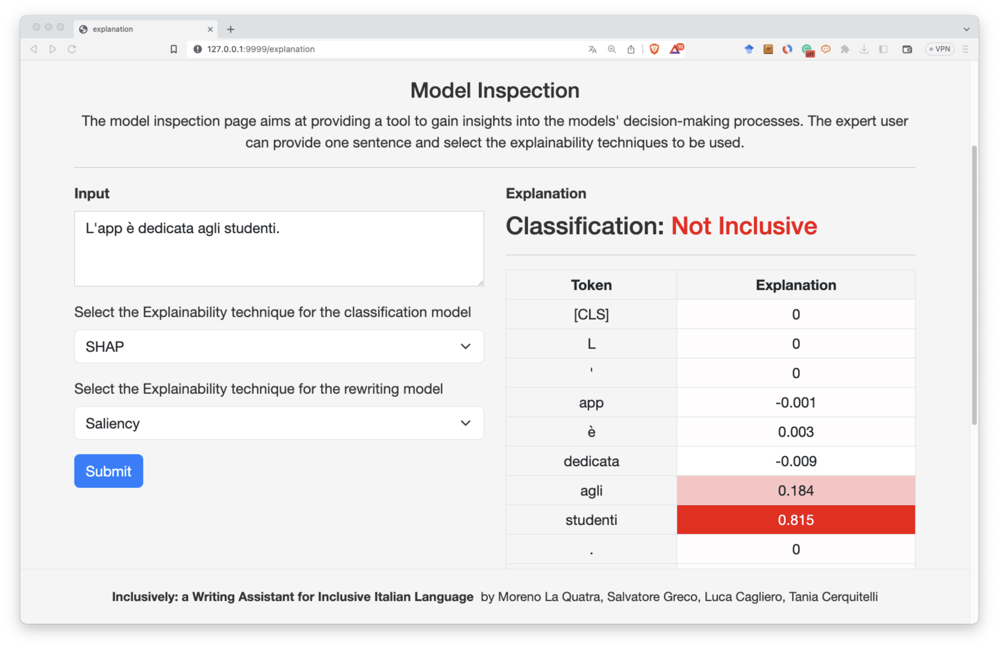

# Inclusively

Inclusively aims at creating deep learning models that can detect and correct non-inclusive language writing.

It leverages an NLP pipeline that includes:

- **Detection**: It detects non-inclusive language in the text using text classification techniques.
- **Rewriting**: If some non-inclusive language is detected, a sequence-to-sequence model is used to modify the text and suggest a more inclusive rewriting.

If you find this project useful, please consider citing the papers listed in the [References](#references) section.

# Table of Contents

- [Methodology and Models](#methodology-and-models)
- [Project Demo](#demo)
  - [How does it work?](#how-does-it-work)
  - [Screenshots](#screenshots)
  - [Supported languages](#supported-languages)
- [References](#references)
- [People behind Inclusively](#people-behind-inclusively)


# Methodology and Models

Inclusively uses a two-stage deep learning pipeline designed to promote inclusive writing. The first stage employs a **classification model** based on transformer architectures to detect non-inclusive sentences. Once detected, the second stage activates a **sequence-to-sequence model**, which generates inclusive reformulations of the identified text. The platform also integrates feedback from expert users, allowing continuous model refinement through a human-in-the-loop approach. This system enables Inclusively to offer accurate and contextually appropriate rewrites while also promoting self-learning in inclusive writing practices.

For more information, you can check out the [paper here](https://doi.org/10.1007/978-3-031-43430-3_31).


## Pre-Trained Models

- 📊 Classification Model: https://huggingface.co/E-MIMIC/inclusively-classification
- 📝 Reformulation Model: https://huggingface.co/E-MIMIC/inclusively-reformulation-it5
  
# Demo

This repository also contains the Flask application that powers the [Inclusively](#) platform demo.
This demo has been accepted at [ECML PKDD 2023 - Demo Track](https://2023.ecmlpkdd.org/).

## How does it work?

The platform is composed of 4 main pages:

- **Home**: The home page of the platform. It contains a brief description of the platform and a link to the demo.
- **Testing**: The testing page. It contains the demo itself and the possibility to insert the text to be corrected by Inclusively.
- **Evaluation**: The evaluation page. It allows users to evaluate the correctness of the corrections made by Inclusively. Each user can provide a feedback for each correction at sentence level.
- **Explanation**: The explanation page. It contains the output of explainability methods applied to the model. It can allow *data scientists* to understand how the model works and how it makes its decisions.

## Screenshots

**Home page**



**Assistant page**



**Evaluation and Annotation page**



**Explanation page**



## Supported languages

- 🇮🇹 Italian 
- [WIP] 🇫🇷 French   
- [WIP] 🇪🇸 Spanish

# References

If you find this project useful, please consider citing the following papers:

**Inclusively: An AI-Based Assistant for Inclusive Writing**
```bibtex
@InProceedings{10.1007/978-3-031-43430-3_31,
	author="La Quatra, Moreno and Greco, Salvatore and Cagliero, Luca and Cerquitelli, Tania",
	title="Inclusively: An AI-Based Assistant for Inclusive Writing",
	booktitle="Machine Learning and Knowledge Discovery in Databases: Applied Data Science and Demo Track",
	year="2023",
	publisher="Springer Nature Switzerland",
	address="Cham",
	pages="361--365",
	isbn="978-3-031-43430-3"
}
```

A paper describing the methodology and the models trained for this project is **currently under review** and will be added here upon acceptance.

# People behind Inclusively

- **Moreno La Quatra** - [Homepage](https://mlaquatra.me) - [GitHub](https://github.com/MorenoLaQuatra) - [Twitter](https://twitter.com/MorenoLaQuatra)
- **Salvatore Greco** - [Homepage]() - [GitHub]()
- **Luca Cagliero** - [Homepage](https://www.polito.it/en/staff?p=luca.cagliero)
- **Tania Cerquitelli** - [Homepage]()
